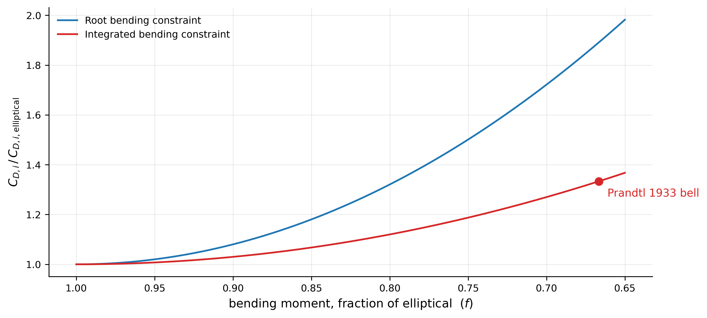
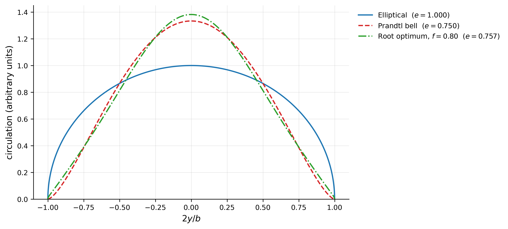
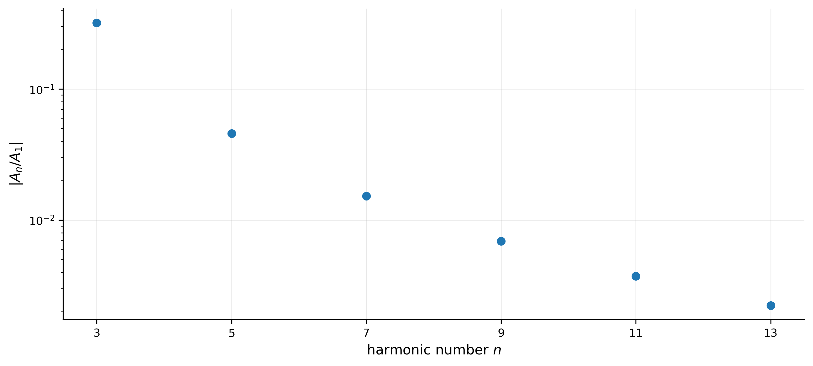

# Why real wings aren't elliptical

Prandtl's lifting-line theory says the elliptical spanwise lift distribution minimises induced
drag for a given lift. Almost nothing since the Spitfire uses one. The standard result
treats the wing as a pure aerodynamic object, but a wing is also a cantilever beam:
lift generated near the tip has a long moment arm about the root and is structurally
expensive. The elliptical optimum is optimal only if structure is free.

This project adds a bending-moment constraint to the optimisation and quantifies what
it costs.

*The same fractional bending relief costs 8/3 times more induced drag under a
root-bending constraint than under an integrated one. The choice of structural
criterion changes the optimal wing.*

## Method

Circulation is represented as a Fourier sine series under the substitution
$y = -\frac{b}{2}\cos\theta$:

$$\Gamma(\theta) = 2bV_\infty \sum_n A_n \sin n\theta$$

Lift is linear in this series, so orthogonality removes every harmonic above the first
and $C_L = \pi\,AR\,A_1$. Induced drag is quadratic — circulation acting against the
downwash it generates — so orthogonality leaves the squares instead of cancelling them,
and the downwash being built from $d\Gamma/dy$ contributes a further factor of $n$:

$$C_{D,i} = \pi\,AR \sum_n n A_n^2$$

Higher harmonics therefore redistribute lift without adding any, while costing drag in
proportion to $n$. Elliptical loading wins when nothing else constrains the problem.

Bending moment is linear in the coefficients. Minimising a quadratic objective subject
to a linear constraint admits a closed-form solution by Lagrange multipliers, so there
is no solver and nothing to converge. Two structural criteria are compared: root
bending (moment arm $y$, the peak load carried at the wing–fuselage junction) and
integrated bending (moment arm $y^2$, a proxy for total spar material).

## Validation

Four independent checks, each passing before any new result was computed.

1. The bell distribution constructed as a Fourier pair $\{A_1, A_3\} = \{1, -1/3\}$
   agrees with $\tfrac{4}{3}\sin^3\theta$ to $4\times10^{-16}$.
2. Bending influence coefficients match an analytic form derived by product-to-sum,
   $I_n = -(-1)^{(n-1)/2}/(n^2-4)$, to better than $10^{-9}$ across seven harmonics.
3. Under an integrated-bending constraint at $f = 2/3$, the optimiser returns
   $A_3/A_1 = -1/3$ with all higher harmonics at machine zero. This is Prandtl's 1933
   bell-shaped distribution, recovered from code containing no reference to it.
4. The closed-form trade-off law below reproduces all 62 independently computed sweep
   rows to machine precision.

## Results

The induced-drag penalty is exactly quadratic in the bending relief demanded:

$$\frac{C_{D,i}}{C_{D,i,\text{ell}}} = 1 + c\,(1-f)^2, \qquad
c = \frac{C_1^2}{2\sum_{n\geq3} C_n^2/(2n)}$$

where $f$ is bending as a fraction of elliptical. The quadratic form is forced rather
than fitted: every coefficient scales with $(f-1)$ by a common factor, so the optimum
travels along a fixed ray in coefficient space, and a quadratic form evaluated along a
line is a parabola. Marginal cost therefore rises linearly — the first few percent of
structural relief are nearly free, the last few are ruinous.

**The two criteria differ by exactly 8/3.** $c_I = 8$ and $c_K = 3$, both exact.
Truncating the series at $n = 7$ gives $c_I = 8.018$, converging to $8.000$ by
$n = 51$; the truncation error is 0.227%.

**Prandtl's bell is not a distinguished shape.** Under integrated bending the optimum
is $A_3/A_1 = f - 1$ exactly, so the optima form a one-parameter family and $f = 2/3$
is simply where the bell sits. This follows because $K_1 = K_3 = \pi/16$ and $K_n = 0$
for all $n \geq 5$ — integrated bending is blind to harmonics above the third.

**Under root bending the bell is beaten.** At identical lift and identical root bending
moment, the bell gives a drag ratio of 1.3333 against the optimum's 1.3207. Root
bending sees $I_5$ and $I_7$, so the optimum uses harmonics the bell does not have.

Span efficiency falls from 1.000 unconstrained to 0.757 at $f = 0.80$ under root
bending — squarely within the 0.7–0.85 range real aircraft occupy.

*The bell and the root-bending optimum are visually indistinguishable; a 1% difference
in induced drag does not show up to the eye.*

*Coefficient magnitudes fall roughly two decades between $n = 3$ and $n = 13$, which is
what makes truncation at $n = 7$ defensible.*

## Limitations

**This optimises the loading, not the wing.** Recovering a planform and twist
distribution that produce a given $\Gamma(y)$ is the inverse problem and is
underdetermined — chord and local lift coefficient are two free functions with one
equation between them, so infinitely many wings produce any target loading.

**Bending moment is a proxy for structural cost, not structural cost.** Whether root or
integrated bending is the more honest criterion depends on whether the spar is sized by
peak stress at the root or by total material along the span. This work quantifies one
side of a trade rather than resolving it.

**Inviscid throughout.** Profile drag depends on local $c_l(y)$, which requires a chord
distribution, so adding viscosity leaves the loading-level framework entirely.

**Mach-invariant below $M_{cr}$.** Neither the objective nor the constraint contains
$M_\infty$ or aspect ratio; this was verified numerically by rescaling $AR$ by
$\beta = \sqrt{1-M_\infty^2}$ up to $M = 0.8$, with drag ratios unchanged to machine
precision. The wing that produces the loading is not Mach-invariant, and above $M_{cr}$
shocks break the potential-flow framework the argument rests on.

## Next steps

Extending to profile drag requires committing to a specific planform and solving the
inverse problem, which is the natural continuation. Separately, a critical-Mach solver
validated against measured NACA 2412 pressure data would let the $M_{cr}$ boundary
above be stated quantitatively rather than assumed.

## Repository

- `wing_loading_tradeoff.ipynb` — full analysis, runs top to bottom
- `figures/` — the three figures above

Requires NumPy and Matplotlib.
