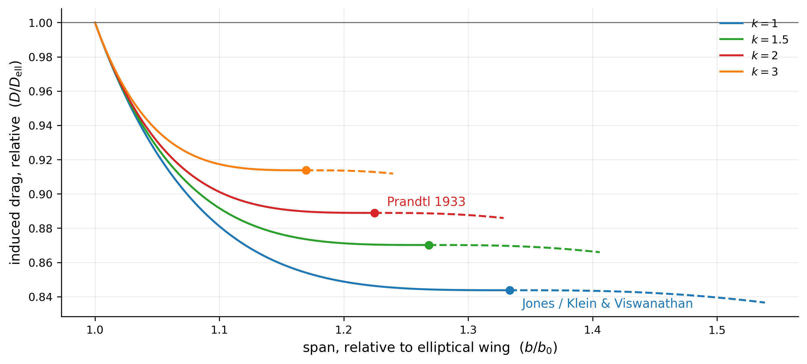
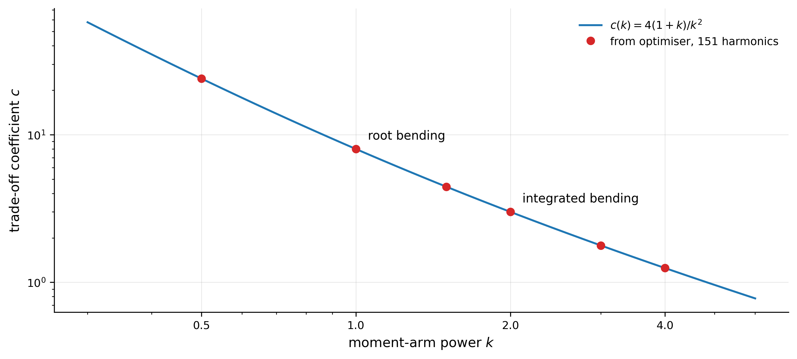
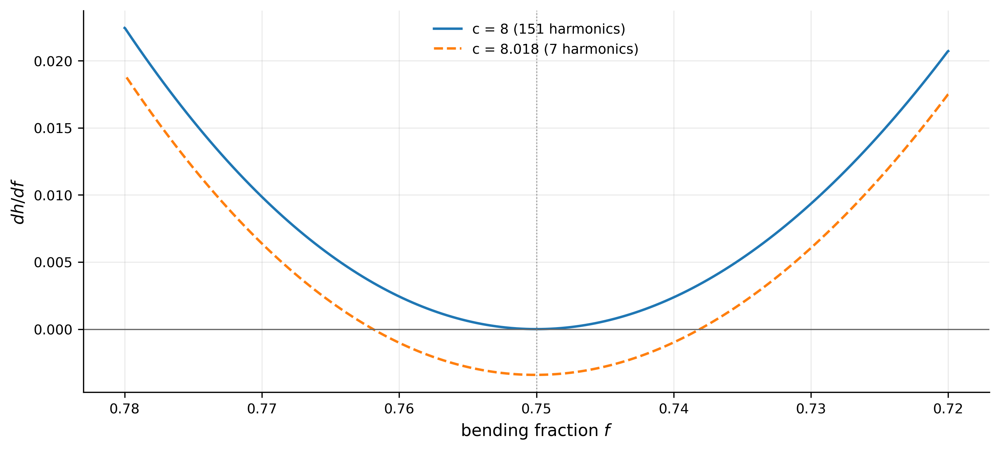
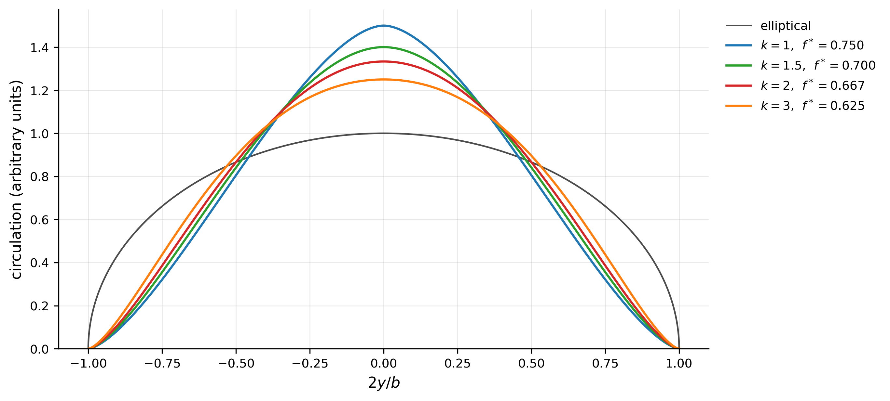

# Why real wings aren't elliptical

Prandtl's lifting-line theory says the elliptical spanwise lift distribution minimises
induced drag for a given lift and span. Almost nothing since the Spitfire uses one. The
reason is structural: lift near the tips has a long moment arm about the root, so the
elliptical wing is only optimal if structure is free.

This project adds a bending constraint to the minimum-induced-drag problem and finds that
two classical results, Prandtl (1933) and Jones (1950) / Klein and Viswanathan (1973),
are special cases of a single closed-form law.

*Induced drag against span for wings carrying the same lift and the same bending as an
elliptical wing. Each curve flattens at a single inflection point. The $k = 1$ and $k = 2$
points reproduce Klein and Viswanathan and Prandtl exactly.*

## The result

For a bending constraint with moment arm $|y|^k$, where $k = 1$ is root bending and
$k = 2$ is Prandtl's integrated bending, the induced-drag penalty at fixed span is

$$
\frac{C_{D,i}}{C_{D,i,\text{ell}}} = 1 + c(k)\,(1-f)^2, \qquad c(k) = \frac{4(1+k)}{k^2}
$$

where $f$ is the bending as a fraction of the elliptical wing's.

When span is allowed to grow at fixed bending, this exact value of $c$ makes the drag
curve's only stationary point a degenerate inflection, located at

$$
f^* = \frac{2+k}{2(1+k)}, \qquad
\frac{b}{b_0} = \left(\frac{2(1+k)}{2+k}\right)^{1/k}, \qquad
\frac{D}{D_\text{ell}} = \frac{2+k}{1+k}\,(f^*)^{2/k}
$$

| $k$ | criterion | span | induced drag | previously known as |
|---:|---|---:|---:|---|
| 1 | root bending | +33.3% | −15.6% | Klein and Viswanathan, 1973 |
| 1.5 | | +26.8% | −13.0% | |
| 2 | integrated bending | +22.5% | −11.1% | Prandtl, 1933 |
| 3 | | +17.0% | −8.6% | |

*The trade-off coefficient computed by the optimiser (markers) against the closed form
(line).*

## Method

Circulation is written as a Fourier sine series under $y = -\frac{b}{2}\cos\theta$:

$$
\Gamma(\theta) = 2bV_\infty \sum_n A_n \sin n\theta, \qquad
C_L = \pi\,AR\,A_1, \qquad C_{D,i} = \pi\,AR\sum_n nA_n^2
$$

Bending is linear in the coefficients, $B = \sum_n A_n C_n$, with influence coefficients

$$
C_n(k) = \int_{\pi/2}^{\pi} \sin n\theta\,(-\cos\theta)^k\sin\theta\,d\theta
$$

A quadratic objective under linear constraints has a closed-form Lagrange solution,
$A_n = \lambda C_n/(2n)$, which gives $c = C_1^2 / \sum_{n\geq3} C_n^2/n$.

**Proof of $c(k)$.** Product-to-sum splits $C_n$ into two standard integrals of
$\cos^k\varphi\cos m\varphi$, which combine into a single ratio of Gamma functions. The
sum for $c$ then becomes a very-well-poised ${}_5F_4$ series, evaluated by the
Rogers–Dougall theorem (DLMF 16.4.9):

$$
\sum_{n\ \text{odd}} \frac{C_n^2}{n\,C_1^2} = \frac{(1+k/2)^2}{1+k}
\quad\Longrightarrow\quad c(k) = \frac{4(1+k)}{k^2}
$$

**Span extension.** Bending scales as $L\,b^k f$ and induced drag as $(1+\delta)/b^2$, so
at fixed bending

$$
\frac{D}{D_\text{ell}} = \big[1 + c(1-f)^2\big]\,f^{2/k}
$$

Its derivative contains a quadratic with discriminant $c\,[\,ck^2 - 4(1+k)\,]$, which
vanishes identically when $c = c(k)$.

## Validation

- **Prandtl recovered.** Under integrated bending at $f = 2/3$ the optimiser returns
  $A_3/A_1 = -1/3$ with all higher harmonics at machine zero, from code containing no
  reference to the bell.
- **$c(k)$, three ways.** From the optimiser with adaptive quadrature (151 harmonics),
  agreement within $2.5\times10^{-7}$ for $k = 0.5$ to $4$. From the closed-form $C_n$,
  within $10^{-10}$ of numerical integration. From the hypergeometric series directly,
  within $10^{-10}$.
- **Published results reproduced.** $k = 1$ gives span $4/3$ and drag $27/32$; $k = 2$
  gives span $\sqrt{3/2}$ and drag $8/9$.
- **Inflection, not minimum.** The numerical derivative of the drag curve is never
  meaningfully negative (minimum $-8\times10^{-10}$, attributable to truncation).
- **Mach invariance below $M_{cr}$.** Rescaling $AR \to \beta AR$ leaves every ratio
  unchanged to $2\times10^{-16}$, since neither objective nor constraint contains
  $M_\infty$ or $AR$.

## Two further observations

**Exactness matters.** Truncating at seven harmonics gives $c = 8.018$ instead of 8. The
discriminant turns positive and the model predicts a spurious local minimum at span
1.31. The exact value is what makes the classical optima inflections.

**Why the curve flattens where it does.** At $f^*$ the optimal loading meets the tips with
zero slope. Above $f^*$ the whole wing lifts; below it the tips carry download. This is
the physical reason the classical designs stop at the inflection, and it explains why
Prandtl's bell sits at $f = 2/3$: that is $f^*$ for $k = 2$.

## What is proven and what is not

| claim | status |
|---|---|
| $c(k) = 4(1+k)/k^2$ | proven, citing the Rogers–Dougall theorem |
| inflection at $f^*$ for every $k$ | proven, follows from $c(k)$ |
| zero tip slope at $f^*$ | numerical, at $k = 1, 1.5, 2, 3$ |
| a physical reason for the form of $c(k)$ | open |

## Relation to prior work

The minimum-induced-drag problem with structural constraints is classical. Prandtl (1933)
fixed the moment of inertia of lift, which is the $k = 2$ case here. Jones (1950)
fixed root bending, the $k = 1$ case, and Klein and Viswanathan (1973) derived the same
solution independently, later extending it to integrated bending with a shear
constraint. DeYoung (1979) constrained bending at a prescribed spanwise station; Pate and
German (2013) constrained root bending at an off-design lift coefficient; Phillips,
Hunsaker and Joo (2019) showed that different structural models give different optimal
loadings. Ożański (2024) and Karakhanyan and Katgi (2026) give rigorous mathematical
treatments of the $k = 2$ problem.

To my knowledge, the general coefficient $c(k)$ and the result that the span-extension
stationary point is a degenerate inflection for every $k$ have not been reported. I would
welcome correction.

I derived the fixed-span problem from Anderson's *Introduction to Flight* before reading
this literature, and found the prior work afterwards.

## Limitations

- **This optimises the loading, not the wing.** Recovering a planform and twist that
  produce a given $\Gamma(y)$ is a separate, underdetermined problem.
- **Bending moment is a proxy for structural cost.** $k = 1$ and $k = 2$ have clear
  physical meaning; non-integer $k$ is a mathematical interpolation between them.
- **Lifting-line assumptions throughout:** inviscid, high aspect ratio, unswept, planar
  wake.
- **Below $M_{cr}$ only.** Shocks and wave drag break the framework above it.

## Next steps

Designing twist distributions that realise these loadings and validating them with an
independent vortex-lattice solver, followed by a physical test of the spanwise centre of
lift on twisted semi-span models.

## Acknowledgements

This is self-directed work. I used AI assistance (Claude) substantially for derivations,
code and writing, and have worked through and reproduced every result.

## Repository

- `wing-loading-tradeoff.ipynb` — full analysis, runs top to bottom
- `figures/` — all figures
- `summary.pdf` — one-page summary

Requires NumPy, SciPy and Matplotlib.

## References

- Anderson, J. D., *Introduction to Flight*, 8th ed.
- Prandtl, L. (1933), *Zeitschrift für Flugtechnik und Motorluftschiffahrt* 24.
- Jones, R. T. (1950), NACA TN 2249.
- Klein, A. and Viswanathan, S. P. (1973), *ZAMP* 24.
- DeYoung, J. (1979), NASA CR-3140.
- Pate, D. J. and German, B. J. (2013), *Journal of Aircraft* 50(3).
- Phillips, W. F., Hunsaker, D. F. and Joo, J. J. (2019), *Journal of Aircraft* 56(2).
- Ożański, W. S. (2024), *Applied Mathematics and Optimization* 89.
- Karakhanyan, A. L. and Katgi, Y. (2026), arXiv:2606.12757.
- Bragado-Aldana, E., Lone, M. and Riaz, A. (2020), ICAS 2020.
- Olver, F. W. J. et al., *NIST Digital Library of Mathematical Functions*, §16.4.
